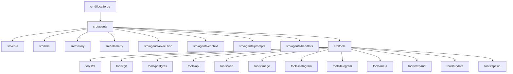

# Architecture

## Package Dependencies



## Key Packages

**Core Agent System:**
- `src/agents/` - Agent orchestrator (delegates to sub-packages)
- `src/agents/execution/` - Chat loop & tool execution engine
- `src/agents/context/` - Context management & truncation strategies
- `src/agents/prompts/` - Prompt building
- `src/agents/handlers/` - System event handlers

**Extracted Packages (Reusable):**
- `src/history/` - Conversation history management
- `src/telemetry/` - Observability (tool execution, tokens, truncation)

**Core Abstractions:**
- `src/core/` - Core interfaces (Plugin, Tool, Executable)
- `src/llms/` - LLM engine implementations

**Extensions:**
- `src/tools/` - Built-in tools (fs, git, postgres, api, web, image, instagram, telegram, meta, expand, update, spawn)
- `src/plugins/` - Plugin system (logger, todo, vault, procedures, scheduler, heartbeat, brain)

## Import Patterns

```go
// ✅ Correct: agents package imports system package
import "github.com/thinktwiceco/agent-forge/src/agents/system"

// ❌ Never: system package MUST NOT import agents (circular dependency)
```

## Complete Structure

See [docs/FILE_STRUCTURE.md](../FILE_STRUCTURE.md) for detailed breakdown.
