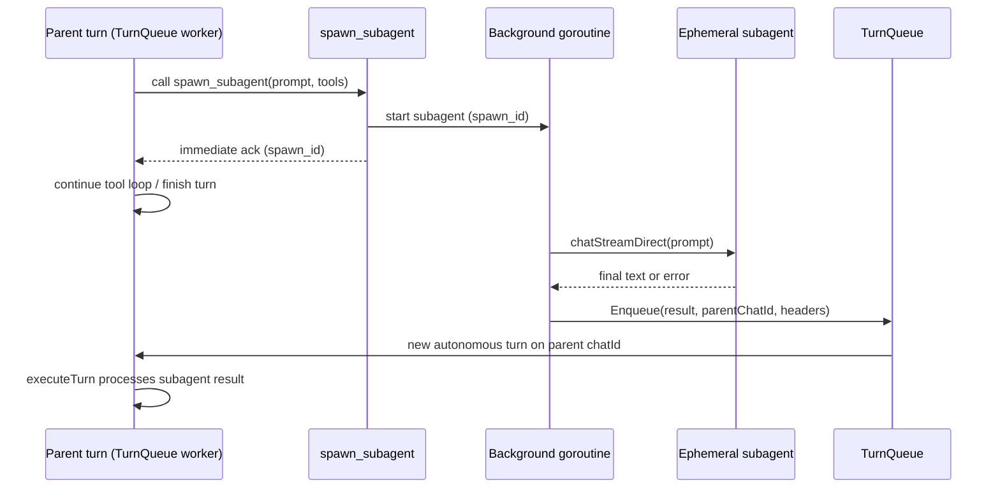

# Plan: Async Spawn Subagent

**Feature name:** `async-spawn-subagent`
**Status:** approved
**Date:** 2026-07-04

## Goal

Replace synchronous `spawn_subagent` with **fire-and-forget async spawn**. The tool returns immediately with a `spawn_id`; the subagent runs in a background goroutine and, on completion, **submits a new turn on the parent `chatId`** via `TurnQueue.submitSpawnResult` (same ingress as `Enqueue`, with logged Submit errors). The parent agent continues its current turn without blocking; the subagent result is processed in a follow-up turn on the same conversation.

## Requirements

| Dimension | Detail |
|-----------|--------|
| **What** | Async-only `spawn_subagent`: immediate ack + completion turn enqueued to parent `chatId` |
| **Why** | Parent should not block on long subagent work; model was incorrectly describing sync spawn as background async; aligns spawn with unified TurnQueue autonomous message pattern |
| **Who** | Main agent (parent), LLM callers using `spawn_subagent`, Localforge UI (follow-up turn appears in same conversation) |
| **Where** | `src/tools/spawn`, `src/agents/agentInit.go`, `src/agents/agent_spawn.go`, `src/agents/turn_queue.go`, prompts/docs |
| **When** | After unified TurnQueue (done); replaces current sync behavior entirely (user confirmed) |

## Success criteria

- [ ] `spawn_subagent` returns within one tool-call timeslice (no wait on subagent LLM loop)
- [ ] Subagent completion enqueues an autonomous turn on the **parent** `chatId` via `TurnQueue.Enqueue`
- [ ] Parent `chatId` turn FIFO is preserved among queued turns (completion turn runs after parent turn finishes; user messages enqueued later may interleave — same as any autonomous turn)
- [ ] Multiple concurrent spawns from one parent turn are allowed; each completion enqueues its own follow-up turn
- [ ] Subagent failure enqueues an error completion turn (not silent loss)
- [ ] Prompts/docs no longer describe sync spawn
- [ ] Tests cover immediate return, enqueue on success/failure, and parent non-blocking behavior

## Context from Explorer

### spawn_subagent today (sync)

```
OUT:
  answer: spawn_subagent blocks in tool handler; factory builds ephemeral subagent, runs chatStreamDirect (bypasses parent TurnQueue), drainSubagentResponse, returns string as tool result. Parent executor adds tool message and continues loop.
  locations:
    - src/tools/spawn/tool.go:17-104
    - src/agents/agentInit.go:145-165
    - src/agents/agent_spawn.go:46-82
    - src/agents/execution/executor.go:280-372
  confidence: high
```

### TurnQueue.Enqueue (autonomous path)

```
OUT:
  answer: Enqueue formats headers into body, sets Source from headers[sender], submits with ResponseCh=nil. handleTurn routes nil ResponseCh through chunkRouter/turnCompleteRouter goroutine path. Per-chatId FIFO via dedicated chat workers.
  locations:
    - src/agents/turn_queue.go:134-147
    - src/agents/agent_turn.go:19-43
    - src/plugins/heartbeat/plugin.go:124-129
    - src/plugins/scheduler/consumers.go:25-29
  confidence: high
```

### No executor async-tool pattern

```
OUT:
  answer: Executor always wg.Wait() on tools; no pending/deferred tool results. Background enqueue only via InboxAware plugins. Tools do not receive Inbox/TurnQueue in agentContext today.
  locations:
    - src/agents/execution/executor.go:278-305
    - src/agents/agentInit.go:286-288
  confidence: high
```

**Note:** `chatId` is already available in tool `agentContext` via `BuildContext` (`src/core/agentContext.go:64-68`).

## Approach

### Error boundaries (sync vs async)

| Failure | When | Delivery |
|---------|------|----------|
| Empty `chatId` | Tool handler (sync) | Tool error — no `spawn_id`, no goroutine |
| Invalid/missing tools | Tool handler (sync) | Non-fatal skip; continue spawn |
| Subagent `Build()` failure | Before goroutine start (sync) | Tool error — no `spawn_id` |
| Registry insert failure | Before goroutine start (sync) | Tool error — no `spawn_id` |
| Subagent LLM/stream failure | Background goroutine (async) | Enqueue with `status: error` |
| Empty subagent response | Background goroutine (async) | Enqueue with `status: error` |
| Agent stopped / job cancelled | Background goroutine (async) | Drop enqueue; debug log only |
| TurnQueue stopped on enqueue | Background goroutine (async) | Drop enqueue; debug log (same as heartbeat) |

### Stop() and cancellation contract

`spawnJob` (stored in `Agent.spawnRegistry` in `agent.go`, helpers in `agent_spawn.go`):

```go
type spawnJob struct {
    spawnID      string
    parentChatID string
    cancel       context.CancelFunc
}
```

**`Agent.Stop()` ordering:**

1. Lock registry; call `cancel()` on every in-flight job
2. Clear registry
3. `turnQueue.Stop()`

Background goroutine checks cancellation before submit; if cancelled or registry entry removed, skip submit and log debug.

**Completion submit:** Add `TurnQueue.submitSpawnResult(body, parentChatID, headers map[string]string) error` — formats headers like `Enqueue`, calls `Submit`, returns/logs error. Spawn goroutine uses this instead of `Enqueue`.

### Architecture



**Key design choices (user confirmed):**
- Replace sync spawn entirely — no dual-mode / `wait` flag
- Completion delivery via **Enqueue → follow-up turn** on parent `chatId` (not deferred tool result / executor changes)

### Completion message contract

Headers (via `queue.FormatHeaders`):

| Header | Value |
|--------|-------|
| `sender` | `subagent` |
| `task_type` | `subagent_result` |
| `spawn_id` | UUID assigned at spawn time |
| `status` | `success` or `error` |

Body (after blank line):

- **success:** subagent final text (from `drainSubagentResponse`)
- **error:** human-readable error string

Example enqueued message:

```
sender: subagent
spawn_id: 7c3e9a12-...
status: success
task_type: subagent_result
timestamp: 2026-07-04T20:21:00Z

The factorial of 10 is 3628800. Poem: ...
```

Immediate tool return (success path):

```
Subagent spawned (spawn_id: 7c3e9a12-...). Result will arrive as a follow-up message in this conversation.
```

### Implementation steps

1. **Refactor spawn factory contract** (`src/tools/spawn/tool.go`, `src/agents/agentInit.go`)
   - Change `SubagentFactory` to async spawner:
     ```go
     type AsyncSubagentSpawner func(parentChatID, prompt string, tools []llms.Tool) (spawnID string, err error)
     ```
   - Tool handler reads `chatId` from `agentContext`; error if empty (spawn requires parent conversation context)
   - Return immediate ack string; do not call blocking factory

2. **Async spawn runtime** (`src/agents/agent_spawn.go`, `src/agents/agent.go`)
   - Add `spawnRegistry map[string]spawnJob` + mutex on `Agent` struct (`agent.go`)
   - Factory closure captures parent `a.turnQueue`, `llmEngine`, `workingDir`
   - **Sync path (tool handler):**
     - Validate `chatId` (error if empty)
     - **Build ephemeral subagent synchronously** — fail tool call on `Build()` error (no `spawn_id`)
     - Register job with cancel context; start goroutine; return `spawn_id`
   - **Async path (goroutine):**
     - Respect job cancel context; pass ctx into `chatStreamDirect` so LLM loop aborts on `Agent.Stop()`
     - `chatStreamDirect(ctx, prompt, "")` + `drainSubagentResponse`
     - On success/failure (if not cancelled): submit completion turn via **`turnQueue.submitCompletion(...)`** helper that builds the same `turnRequest` as `Enqueue` but calls `Submit` and **debug-logs on error** (do not use silent `Enqueue` for completions)
     - Remove from registry; `defer sub.Stop()`
   - Extend `Agent.Stop()`: cancel all registry jobs → clear registry → `turnQueue.Stop()`

3. **TurnQueue / handleTurn** — no structural changes required
   - Reuse existing autonomous path (`ResponseCh == nil`)
   - Update `chatStreamDirect` comment: child bypasses TurnQueue; completion re-enters parent TurnQueue via Enqueue

4. **Prompts and docs**
   - `src/agents/prompts/files/main/main-agent.md`:
     - spawn returns immediately with `spawn_id`; result arrives as a follow-up turn in the same conversation
     - On turns containing `task_type: subagent_result`, read `spawn_id`/`status`, present the body to the user; do not poll
   - `docs/agents/how-to-system-agents.md`, `docs/agents/architecture.md`, `docs/TOOLS.md`, `README.md`, `CHANGELOG.md`
   - `src/agents/prompts/builder_test.go` — update spawn guidance assertions

5. **Tests** (`src/agents/agent_spawn_test.go`)
   - **All spawn tool tests must pass `chatId` in agentContext** (via mock `ResponseCh` or literal `"chatId": "test-conv"`)
   - Rewrite `TestSpawnSubagentFactory_ReturnsSubagentText` → assert immediate `spawn_id` ack (not subagent text in tool result)
   - Immediate return while subagent still running
   - `submitSpawnResult` called with correct `parentChatId` and headers on completion
   - Error path enqueues `status: error`
   - Parent turn not blocked — rename `TestSpawnSubagentFactory_UsesDirectPath` → assert non-blocking while parent chat worker stalled
   - `Agent.Stop()` cancels in-flight spawn — no enqueue after stop

### Data model changes

None (no DB). In-memory `spawnRegistry` on `Agent` only.

### API / interface changes

| Surface | Change |
|---------|--------|
| `spawn.SubagentFactory` | Renamed/replaced by `AsyncSubagentSpawner` (breaking within repo only) |
| `spawn_subagent` tool result | Immediate ack with `spawn_id` instead of subagent answer |
| TurnQueue ingress | New `sender: subagent` / `task_type: subagent_result` messages |
| YAML / config | No change (`agent.spawn_subagent: true` still gates the tool) |

## Risks and mitigations

| Risk | Mitigation |
|------|------------|
| Agent reload while spawn in-flight | Registry tied to agent instance; `Stop()` cancels jobs; completion after stop is dropped (log debug). Document behavior. |
| Empty parent `chatId` | Tool returns error — spawn requires active conversation |
| Follow-up turn ordering vs user messages | Per-chatId FIFO in TurnQueue preserves order |
| Model tells user to poll | Prompt + tool AdvanceDesc state async delivery explicitly |
| Multiple completion turns flood parent | Expected; prompt instructs parent to summarize when processing `subagent_result` |
| Subagent uses separate chatId internally | Unchanged — subagent runs with empty/`""` chatId via `chatStreamDirect`; only parent routing matters |

## Open questions

- [ ] **UI labeling:** Autonomous subagent completion turns appear as normal assistant turns in SSE (no badge in MVP). Deferred UI work.
- [ ] **Heartbeat-style suppression:** Should empty/no-op subagent results be suppressed? Deferred — unlike heartbeat ack, subagent results are always meaningful.
- [ ] **Spawn limit:** Cap concurrent in-flight spawns per agent? Deferred — start unlimited; add config later if needed.

## Implementation slices

| ID | Description | Status | Reviewer round |
|----|-------------|--------|----------------|
| S1 | Async spawner contract + spawn tool immediate return + error boundary table | done | 1 |
| S2 | spawnRegistry, sync Build, BG goroutine with cancel ctx, submitSpawnResult, Stop() | done | 1 |
| S3 | Prompts + docs update (async semantics) | done | 1 |
| S4 | Tests: non-blocking, enqueue headers, error path, Stop cancellation | done | 1 |

## Review history

| Round | Phase | Verdict | Blockers resolved | Notes |
|-------|-------|---------|-------------------|-------|
| 1 | planning | revise | — | Stop/cancel, error boundaries, prompt follow-up, test chatId, schema |
| 2 | planning | revise | F1,F2 | Build sync, Submit logging |
| 3 | planning | approve | F1,F2 | Ready for implementation |
