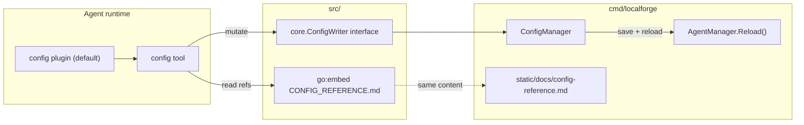

# Plan: Config Tool (default agent tool)

**Feature name:** `config-tool`
**Status:** approved
**Date:** 2026-07-04

## Goal

Add a default **`config`** tool so agents can read configuration documentation and mutate `config.yaml` programmatically (tools, plugins, heartbeat, dreaming). Ship the reference doc in the Localforge binary (embedded for the tool) and web UI static assets (for human browsing).

## Requirements

| Dimension | Detail |
|-----------|--------|
| **What** | Default `config` tool with actions: `get_config_reference`, `get_tools_reference`, `add_tool`, `remove_tool`, `add_plugin`, `remove_plugin`, `set_heartbeat`, `set_dream`. Reference markdown bundled via `go:embed` and copied to Localforge static. |
| **Why** | Agents need self-service discovery of valid config options and the ability to adjust capabilities without manual YAML editing. |
| **Who** | Localforge operators; agents using the tool at runtime. |
| **Where** | `src/plugins/config/` (plugin + tool + embedded doc), `src/core/` (ConfigWriter interface), `cmd/localforge/src/config_manager.go` (YAML patch methods), `cmd/localforge/src/static/docs/` (web UI copy). |
| **When** | Planning first; implementation after user approval. |

## Success criteria

- [ ] `config` tool is available on every agent built via `AgentFactory` without listing it in `config.yaml`.
- [ ] `get_config_reference` returns the full embedded configuration reference markdown.
- [ ] `get_tools_reference` returns only the **Tools Configuration** section (tools table + per-tool params + examples).
- [ ] `add_tool` / `remove_tool` persist to `config.yaml` via `yaml.Node` patching (preserves `${VAR}` placeholders elsewhere).
- [ ] `add_plugin` / `remove_plugin` persist plugin list changes (dedupes brain/skills semantics on reload).
- [ ] `set_heartbeat` updates `agent.heartbeat.every` and ensures heartbeat is active (add to plugins or rely on existing auto-activate when heartbeat block exists).
- [ ] `set_dream` updates `agent.brain_plugin.dream` and `dreamTime`.
- [ ] After any mutating action, Localforge triggers agent reload automatically and returns a note in the tool response.
- [ ] Reference doc is served at `/static/docs/config-reference.md` in the web UI.
- [ ] Unit tests cover YAML patch helpers and tool action validation (invalid tool names, duplicate add, remove missing).

## Context from Explorer

```
OUT (tool registration):
  answer: Tools are YAML-listed and resolved in src/builder/tools.go; no default tools today.
          ConfigManager (cmd/localforge, package main) only patches postgres tool fields.
          Brain/skills auto-inject via buildPlugins() — best model for default presence.
  locations: src/builder/tools.go, src/builder/agentBuilder.go, cmd/localforge/src/config_manager.go
  confidence: high

OUT (docs + embed):
  answer: Config docs in docs/CONFIG.md, src/builder/README.md, config.example.yaml.
          Localforge embeds cmd/localforge/src/static via //go:embed in server.go.
          Skills plugin uses go:embed for seeds — precedent for bundled reference content.
  confidence: high

OUT (default injection):
  answer: ToolProvider plugin + blank import in allplugins.go is the pattern.
          ConfigManager is package main — library tool needs ConfigWriter interface + Localforge adapter.
          Reload is explicit POST /api/agent/reload today; plan adds auto-reload from tool handler.
  confidence: high
```

## Approach

### Architecture



1. **`core.ConfigWriter`** — interface in `src/core/interfaces.go` (or `src/core/config_writer.go`) with mutate + reload methods. Config plugin tool handler checks for nil before mutate; returns `"Config mutations not available (no ConfigWriter configured)"`. Read actions still work from embed.

2. **`config` plugin** — new package `src/plugins/config/`:
   - Auto-registers via `registry.Register` in `init()`.
   - Auto-loads in `AgentFactory.buildPlugins()` alongside `skills` (always on; optional `agent.config_tool: false` opt-out mirroring `brain: false`).
   - `ToolProvider` exposes single `config` tool with `action` parameter (skills-tool pattern).
   - Embeds `CONFIG_REFERENCE.md` (canonical source for tool reads).

3. **Reference doc** — extract/consolidate from `src/builder/README.md` into `src/plugins/config/CONFIG_REFERENCE.md` with anchored sections:
   - Full doc for `get_config_reference`
   - `## Tools Configuration` section extracted by heading for `get_tools_reference`

4. **Localforge wiring** — `configWriterAdapter` in `cmd/localforge/src/` implements `core.ConfigWriter` by delegating to extended `ConfigManager` methods, then calls `AgentManager.Reload()`.

5. **Web UI distribution** — canonical file lives at `src/plugins/config/CONFIG_REFERENCE.md`. A **mandatory** test (`TestConfigReferenceSyncedWithStatic`) compares embedded content to `cmd/localforge/src/static/docs/config-reference.md` and fails on drift. Developers run `go generate ./src/plugins/config/` (or `scripts/sync-config-reference.sh`) to copy before commit. Served under existing `/static/*` route.

6. **ConfigManager extensions** — new patch methods using existing `patchYAMLNode` / `yamlMappingNode` patterns:
   - `AddTool(name string, params map[string]any) error`
   - `RemoveTool(name string) error`
   - `AddPlugin(name string) error` / `RemovePlugin(name string) error` (reuse `UpdatePlugins` logic with merge)
   - `SetHeartbeat(every string) error` — patch `agent.heartbeat.every`; create heartbeat block if missing
   - `SetDream(dream string, dreamTime string) error` — patch `agent.brain_plugin`

### Tool action contract

| Action | Params | Behavior |
|--------|--------|----------|
| `get_config_reference` | — | Return full embedded markdown |
| `get_tools_reference` | — | Return `## Tools Configuration` section only |
| `add_tool` | `name` (required), optional tool params as flat keys (`headless`, `port`, `config_folder`, `postgresURL`, …) | Append tool entry if not present |
| `remove_tool` | `name` (required) | Remove first matching tool by name |
| `add_plugin` | `name` (required) | Append if not already listed |
| `remove_plugin` | `name` (required) | Remove from list (cannot remove implicit brain/skills defaults) |
| `set_heartbeat` | `every` (required) | Patch/create `agent.heartbeat.every` only; heartbeat plugin auto-activates when heartbeat block exists (existing `buildPlugins` behavior — no need to append `"heartbeat"` to plugins) |
| `set_dream` | `status` (`on`\|`off`), `time` (optional `HH:MM`) | Patch `brain_plugin.dream` and optionally `dreamTime` |

Validation:
- Reject unknown tool names on `add_tool` (whitelist matches `src/builder/tools.go` constants).
- Reject duplicate `add_tool` / `add_plugin`.
- `remove_tool` / `remove_plugin` error if not found.
- `set_heartbeat`: validate duration via heartbeat `parseInterval`.
- `set_dream`: validate status enum and time format via brain config helpers.

### Implementation steps

1. **Reference doc + embed** — Create `src/plugins/config/CONFIG_REFERENCE.md`; add copy to `cmd/localforge/src/static/docs/config-reference.md`.
2. **core.ConfigWriter** — Define interface; add `builder.SetConfigWriter(w)` hook (mirrors `SetTodoCallback`).
3. **config plugin + tool** — Implement plugin, tool handler, section extractor, tests for read paths.
4. **Auto-load plugin** — Blank import in `allplugins.go`; inject in `buildPlugins()` effective list; optional `config_tool: false` YAML opt-out on `builder.Config.Agent`.
5. **ConfigManager mutations** — Add YAML patch methods + tests in `config_manager_test.go`.
6. **Localforge adapter** — Wire adapter at startup; auto-reload after mutations.
7. **Docs** — Update `src/plugins/README.md` table and `docs/agents/configuration.md` (brief mention only).

### Data model changes

None (file-based YAML only).

### API / interface changes

- New `core.ConfigWriter` interface (library).
- New default plugin `config` (no new HTTP routes required; existing `/static/docs/config-reference.md` for humans).
- Optional YAML field: `agent.config_tool: false` to opt out.

## Risks and mitigations

| Risk | Mitigation |
|------|------------|
| ConfigManager in `package main` blocks direct import | `ConfigWriter` interface + adapter in Localforge only |
| Agent reload mid-turn if agent calls config on itself | Reload swaps agent atomically; in-flight request completes on old agent; document that mutating actions take effect next turn |
| Reference doc drift (embed vs static) | Single canonical file; mandatory sync test in S1; `go generate` copy script |
| Invalid YAML from programmatic add | Validate tool names and required params before patch; reuse builder tool validation where possible |
| Security: agent rewrites own config | Same trust model as fs tool; Localforge auth protects HTTP; tool is intentional capability |

## Open questions

- [x] Opt-out via `config_tool: false` (mirrors `brain: false`).
- [x] `add_plugin` / `remove_plugin` included in v1.
- [x] Auto-reload after mutations — yes, with message in tool response.

## Implementation slices

| ID | Description | Status | Reviewer round |
|----|-------------|--------|----------------|
| S1 | Reference doc, embed, static copy, section extractor + tests | pending | — |
| S2 | `core.ConfigWriter` + config plugin/tool (read actions) + auto-load | pending | — |
| S3 | ConfigManager patch methods (add/remove tool, plugins, heartbeat, dream) + tests | pending | — |
| S4 | Localforge adapter, wiring, auto-reload, integration test | pending | — |

## Review history

| Round | Phase | Verdict | Blockers resolved | Notes |
|-------|-------|---------|-------------------|-------|
| 1 | planning | revise → addressed F1 sync test, F2 heartbeat auto-activate, F3 nil error | F1 | |
