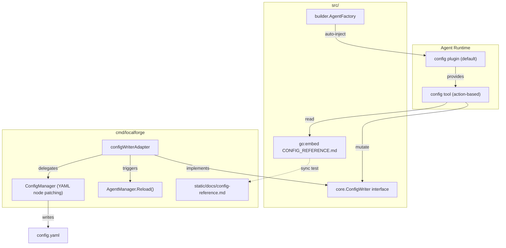
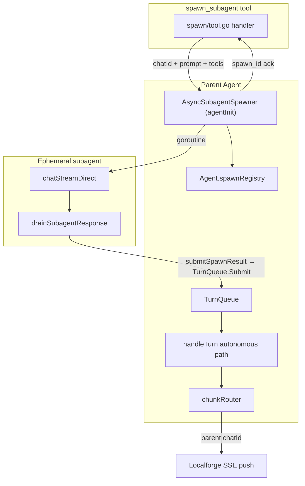

# Schema: config-tool

## Feature scope

Default agent tool enabling self-service configuration discovery and programmatic mutation of `config.yaml`. Agents read embedded reference docs and call actions to add/remove tools and plugins, set heartbeat intervals, and toggle dreaming. Mutations persist via YAML node patching (preserves `${VAR}` placeholders) and trigger automatic agent reload in Localforge.

## Logical connections

## Entities and relationships

| Entity | Location | Connects to | Notes |
|--------|----------|-------------|-------|
| `config` plugin | `src/plugins/config/plugin.go` | `AgentFactory.buildPlugins()` | Auto-loaded like skills; opt-out via `config_tool: false` |
| `config` tool | `src/plugins/config/tools.go` | config plugin (ToolProvider) | Actions: get_config_reference, get_tools_reference, add_tool, remove_tool, add_plugin, remove_plugin, set_heartbeat, set_dream |
| CONFIG_REFERENCE.md | `src/plugins/config/CONFIG_REFERENCE.md` | go:embed | Canonical source |
| ConfigWriter | `src/core/interfaces.go` | config tool handler | Nil outside Localforge |
| configWriterAdapter | `cmd/localforge/src/config_writer_adapter.go` | ConfigManager, AgentManager | Wired at startup |
| ConfigManager patches | `cmd/localforge/src/config_manager.go` | adapter | AddTool, RemoveTool, AddPlugin, RemovePlugin, SetHeartbeat, SetDream |
| static copy | `cmd/localforge/src/static/docs/config-reference.md` | `/static/*` | Sync enforced by test |

## Current patterns

1. Default plugin auto-injection in `buildPlugins()` (brain, skills, heartbeat auto-activate).
2. Action-based tool dispatch (skills tool model).
3. YAML node patching in ConfigManager preserves env var placeholders.
4. go:embed for bundled reference content (skills seeds precedent).
5. Interface + adapter for Localforge-only capabilities (TodoCallback pattern).

## Feature placement

| Component | Path |
|-----------|------|
| Plugin + tool + embed | `src/plugins/config/` |
| Interface | `src/core/interfaces.go` |
| Auto-load wiring | `src/builder/allplugins.go`, `agentBuilder.go` |
| YAML mutations | `cmd/localforge/src/config_manager.go` |
| Adapter + wiring | `cmd/localforge/src/config_writer_adapter.go`, `main.go` |
| Static asset | `cmd/localforge/src/static/docs/config-reference.md` |
| Tests | `src/plugins/config/*_test.go`, `config_manager_test.go` |

---

# Schema: async-spawn-subagent

## Feature scope

Replace synchronous `spawn_subagent` with fire-and-forget async spawn. The tool returns immediately with a `spawn_id`; a background goroutine runs an ephemeral subagent via `chatStreamDirect`, then submits the result onto the parent conversation through `TurnQueue.submitSpawnResult` — the same autonomous path as heartbeat/scheduler.

## Logical connections

## Entities and relationships

| Entity | Location | Connects to | Notes |
|--------|----------|-------------|-------|
| `spawn_subagent` tool | `src/tools/spawn/tool.go` | `AsyncSubagentSpawner` | Reads `chatId` from agentContext; immediate ack |
| Spawner closure | `src/agents/agentInit.go` | `turnQueue`, registry | Starts BG goroutine; no blocking drain |
| `spawnRegistry` | `src/agents/agent.go` | `Agent.Stop()` | In-flight jobs; cancel before queue shutdown |
| Spawn helpers | `src/agents/agent_spawn.go` | `chatStreamDirect`, filter/dedupe | Child bypasses TurnQueue; completion re-enters parent |
| `TurnQueue.Enqueue` | `src/agents/turn_queue.go` | `queue.Inbox` | `ResponseCh=nil` → autonomous turn |
| `handleTurn` | `src/agents/agent_turn.go` | `chunkRouter`, `executeTurn` | Routes subagent_result to parent chatId |
| `agentContext.chatId` | `src/core/agentContext.go` | tool handler | From `responseCh.GetChatId()` |

## Current patterns

1. Autonomous turns via `TurnQueue.Enqueue` with formatted headers (`queue.FormatHeaders`).
2. Ephemeral subagent build in `agentInit` factory — no nested spawn, filtered tool subset.
3. `chatStreamDirect` bypasses TurnQueue for child execution (parallel to parent).
4. Per-`chatId` FIFO serialization in TurnQueue chat workers.
5. `Agent.Stop()` shuts down TurnQueue on reload (`AgentManager.Reload`).

## Feature placement

| Component | Path |
|-----------|------|
| Tool contract | `src/tools/spawn/tool.go` |
| Factory + wiring | `src/agents/agentInit.go` |
| Registry + BG lifecycle | `src/agents/agent_spawn.go`, `src/agents/agent.go` |
| Turn admission | `src/agents/turn_queue.go` (no change) |
| Autonomous routing | `src/agents/agent_turn.go` (no change) |
| Prompts | `src/agents/prompts/files/main/main-agent.md` |
| Docs | `docs/agents/how-to-system-agents.md`, `docs/agents/architecture.md` |
| Tests | `src/agents/agent_spawn_test.go` |
